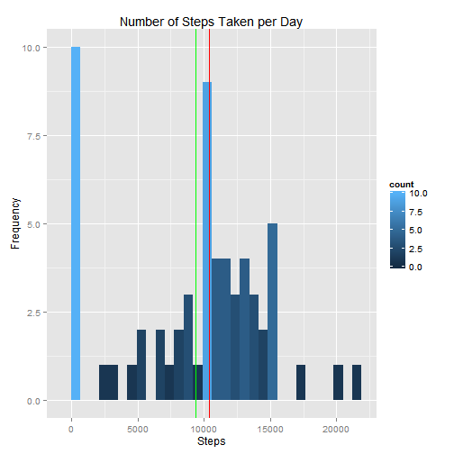
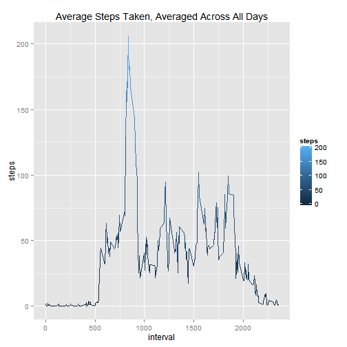
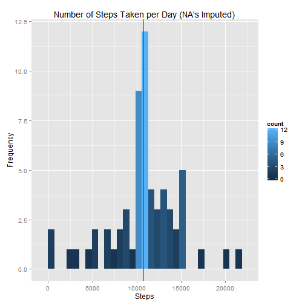
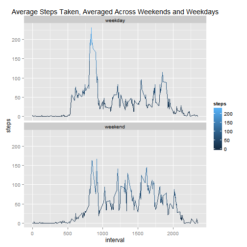

###Introduction  


It is now possible to collect a large amount of data about personal movement using activity monitoring devices such as a Fitbit, Nike Fuelband, or Jawbone Up. These type of devices are part of the "quantified self" movement - a group of enthusiasts who take measurements about themselves regularly to improve their health, to find patterns in their behavior, or because they are tech geeks. But these data remain under-utilized both because the raw data are hard to obtain and there is a lack of statistical methods and software for processing and interpreting the data.

This file makes use of data from a personal activity monitoring device. This device collects data at 5 minute intervals through out the day. The data consists of two months of data from an anonymous individual collected during the months of October and November, 2012 and include the number of steps taken in 5 minute intervals each day.


### Data


The data for this assignment can be downloaded from the course web site (coursera.org - Reproducible Research:

- Dataset: Activity monitoring data [52K]
The variables included in this dataset are:

- **steps**: Number of steps taking in a 5-minute interval (missing values are coded as NA)

- **date**: The date on which the measurement was taken in YYYY-MM-DD format

- **interval**: Identifier for the 5-minute interval in which measurement was taken

The dataset is stored in a comma-separated-value (CSV) file and there are a total of 17,568 observations in this dataset.


### Load Data


```r
activity <- read.csv("activity.csv")
```


### Total Number of Steps Taken Per Day


Histogram of the total number of steps taken each day.


```r
library(ggplot2)
steps.day <- aggregate(activity[1], by = activity[2], FUN = sum, na.rm = T)
ggplot(steps.day, aes(x = steps)) + 
    geom_histogram(aes(fill = ..count..)) +
    ggtitle("Number of Steps Taken per Day")  +
    xlab("Steps") + ylab("Frequency") +
    geom_vline(xintercept = mean(steps.day$steps), colour = "green") +
    geom_vline(xintercept = median(steps.day$steps), colour = "red")
```

```
## stat_bin: binwidth defaulted to range/30. Use 'binwidth = x' to adjust this.
```

 

```r
mean <- mean(steps.day$steps)
median <- median(steps.day$steps)
```


The **mean** (green line) number of steps taken per day is 9,354.23 .  
The **median** (red line) number of steps taken per day is 10,395 .


### Average Daily Activity Pattern


Time series plot of the 5-minute interval (x-axis) and the average number of steps taken, averaged across all days (y-axis).


```r
steps.interval <- aggregate(activity[1], by = activity[3], FUN = mean, na.rm = T)
ggplot(steps.interval, aes(x = interval, y= steps)) +
    geom_line(aes(colour = steps)) +
    ggtitle("Average Steps Taken, Averaged Across All Days")
```

 

```r
steps.max <- steps.interval$interval[which.max(steps.interval$steps)]
```

The **5-minute interval**, on average across all the days in the dataset, with the **maximum number of steps** is 835.


### Imputing Missing Values


```r
num.na <- sum(is.na(activity))
```

The total number of missing values in the dataset is 2304.

New dataset is equal to original dataset but with the missing values replaced by the average steps for that interval.


```r
library(plyr)
replace.nas <- function(x) replace(x, is.na(x), mean(x, na.rm = T))
activity.impute <- ddply(activity, ~interval, transform, steps = replace.nas(steps))
```

Histogram of the total number of steps taken each day.


```r
steps.day.impute <- aggregate(activity.impute[1], by = activity.impute[2], FUN = sum, na.rm = T)
ggplot(steps.day.impute, aes(x = steps)) + 
    geom_histogram(aes(fill = ..count..)) +
    ggtitle("Number of Steps Taken per Day (NA's Imputed)")  +
    xlab("Steps") + ylab("Frequency") +
    geom_vline(xintercept = mean(steps.day.impute$steps), colour = "green") +
    geom_vline(xintercept = median(steps.day.impute$steps), colour = "red")
```

```
## stat_bin: binwidth defaulted to range/30. Use 'binwidth = x' to adjust this.
```

 

```r
mean.impute <- mean(steps.day.impute$steps)
median.impute <- median(steps.day.impute$steps)
```

The **mean** (green line) number of steps taken per day is 10,766.19 .  
The **median** (red line) number of steps taken per day is 10,766.19 .

With this new dataset both the **mean** and the **median** are higher. Moreover, they are now equal to eachother.


### Activity Patterns Between Weekdays and Weekends


Create a new factor variable in the dataset with two levels - "weekday" and "weekend".


```r
activity.weekdays <- weekdays(as.Date(activity.impute$date))
activity.impute$day <- as.factor(ifelse(activity.weekdays %in% c("Saturday", "Sunday"), "weekend", "weekday"))
```

Time series plot of the 5-minute interval (x-axis) and the average number of steps taken, averaged across all weekday days or weekend days (y-axis). 


```r
activity.impute.interval <- aggregate(activity.impute[1], by = activity.impute[c(3,4)], FUN = mean, na.rm = T)

ggplot(activity.impute.interval, aes(x = interval, y = steps)) +
    geom_line(aes(colour = steps)) +
    facet_wrap(~day,nrow = 2) +
    ggtitle("Average Steps Taken, Averaged Across Weekends and Weekdays")
```

 
